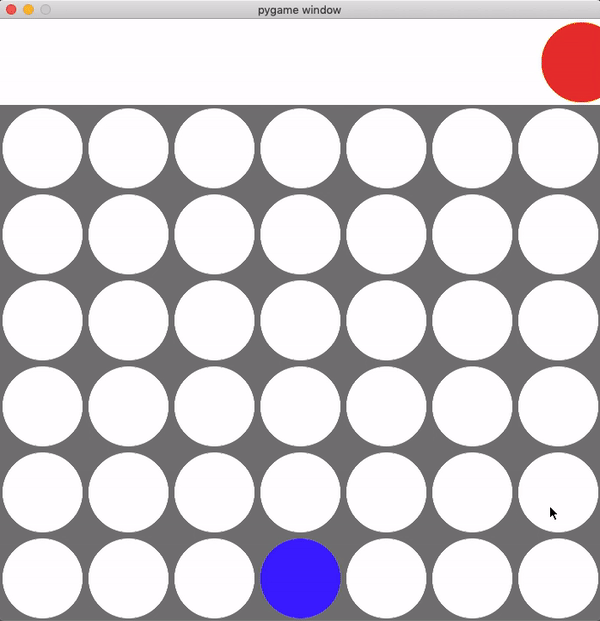

# ConnectFour
A connect 4 game implemented using minimax algorithm with alpha-beta pruning




There are two versions of the connect 4 game in this repository, one for human vs human and the other for human vs AI game mode. As connect 4 is a solved game, the first player will always win if both players are playing optimally. So, the game is set up to randomly choose either the AI or human as the first player to give the fair chance of winning to both players.

You will need python3 and tkinter to run the game. Type the following command in MacOS terminal to install them

```
brew install python3 --with-tcl-tk
```

To play game with the minimax AI, run the python script using the following command:

```
python3 connect4_wAI.py
```


For human vs human mode, enter the following command:

```
python3 connect4_woAI.py
```
